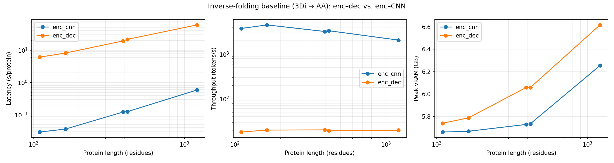

# Run Summary

This summary is based on the current benchmark artifacts in this directory:

- `summary_per_protein.csv`
- `speedup.csv`
- `agreement.csv`
- `baseline_plots.png`
- `hmm_summary.csv`
- `hmm_average_by_bucket.csv`
- `hmm_average_overall.csv`
- `hmm_best_by_variant.csv`

## Baseline inverse-folding: enc-dec vs. enc-CNN

The baseline run compares the full ProstT5 encoder-decoder (`enc_dec`) against the encoder plus CNN head (`enc_cnn`) on 5 proteins spanning lengths from 110 to 1210 residues.

### Main observations

- `enc_cnn` is consistently much faster than `enc_dec` across all tested protein lengths.
- Mean speedup of `enc_cnn` over `enc_dec`: about `173.8x`.
- Per-protein speedup ranges from `103.5x` to `225.7x`.
- `enc_dec` throughput stays roughly flat around `18 to 20` tokens/s, while `enc_cnn` stays in the `2059 to 4497` tokens/s range.
- Peak vRAM grows with protein length for both pipelines, but `enc_cnn` remains below `enc_dec` at every tested length.

### Per-protein highlights

- Short protein (`P01308`, length 110):
  - `enc_cnn`: `0.029 s`
  - `enc_dec`: `6.121 s`
  - Speedup: `208.1x`
- Longest protein (`P00533`, length 1210):
  - `enc_cnn`: `0.588 s`
  - `enc_dec`: `60.805 s`
  - Speedup: `103.5x`
- Peak vRAM at length 1210:
  - `enc_cnn`: `6.255 GB`
  - `enc_dec`: `6.617 GB`

### Agreement and recovery

Agreement between `enc_dec` and `enc_cnn` predictions is limited:

- Mean enc-dec vs. enc-CNN identity: `0.264`
- Mean sequence recovery vs. AFDB AA:
  - `enc_dec`: `0.288`
  - `enc_cnn`: `0.209`

This indicates that the CNN head is a strong latency-oriented approximation, but it does not closely match the full decoder’s residue-level outputs.

## HMM drafter benchmark

The HMM benchmark compares two speculative drafters:

- `naive`: prefix-blind HMM drafter
- `prefix_aware`: re-anchors the HMM after accepted tokens

The current run covers:

- `10` in-family proteins
- `10` out-of-family proteins
- `K in {1, 2, 4, 8, 16}`

### Overall outcome

Across the current run, the `naive` variant is consistently faster than `prefix_aware`.

Best overall average wall time from `hmm_average_overall.csv`:

- `naive, K=16`: `12.091 s`, bit-exact fraction `0.75`, throughput `24.45 tok/s`
- `naive, K=4`: `12.241 s`, bit-exact fraction `0.75`, throughput `23.63 tok/s`
- `naive, K=8`: `12.292 s`, bit-exact fraction `0.80`, throughput `23.96 tok/s`

The prefix-aware variant reaches comparable bit-exact fractions at some `K` values, but it pays a clear overhead from repeated re-anchoring and is slower in aggregate.

### In-family vs. out-of-family

The out-of-family bucket appears easier for the HMM drafter than the in-family bucket in this run.

Best in-family averages:

- `naive, K=16`: `13.203 s`, bit-exact fraction `0.60`
- `naive, K=8`: `13.287 s`, bit-exact fraction `0.60`
- `naive, K=4`: `13.352 s`, bit-exact fraction `0.60`

Best out-of-family averages:

- `naive, K=2`: `10.974 s`, bit-exact fraction `0.90`
- `naive, K=16`: `10.979 s`, bit-exact fraction `0.90`
- `naive, K=4`: `11.130 s`, bit-exact fraction `0.90`

So for this sample:

- Out-of-family proteins are faster on average.
- Out-of-family proteins also show much higher bit-exact rates than in-family proteins.
- Prefix-aware re-anchoring did not translate into better average runtime here.

### Interpretation

The baseline results show a very large latency advantage for the encoder-CNN path, but only modest agreement with the full decoder. The HMM drafter results show that speculative decoding with the current HMM setup remains much closer to verifier-style decoding, but the prefix-aware variant does not yet outperform the simpler naive variant on runtime.

At the moment, the strongest HMM operating points in this run are the naive settings around `K=4` to `K=16`, with `K=16` giving the best average wall time overall.

## Suggested takeaway

If the goal is raw throughput, `enc_cnn` is the clear winner by more than two orders of magnitude. If the goal is a drafter that stays closer to exact greedy verification, the HMM variants are more faithful, but the current implementation favors the simpler naive HMM drafter over the prefix-aware one in runtime.
