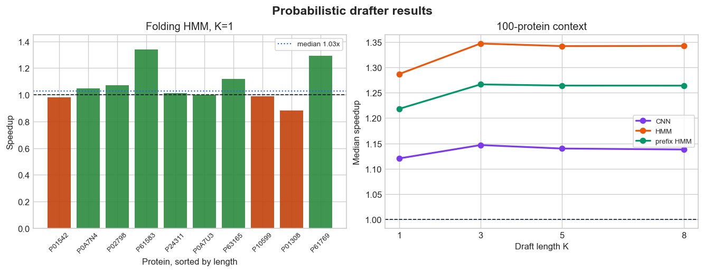

# 1. What Is Our Input, And How Do We Get It?

- Input to the folding task: an amino-acid sequence, `AA`
- Target output: a 3Di structural-alphabet sequence
- Data source in this project:
  - AlphaFoldDB structures are downloaded for benchmark proteins
  - Foldseek extracts paired `AA` and `3Di` FASTA records
  - The notebook keeps only records where `len(AA) == len(3Di)`
- ProstT5 receives the formatted prompt: `<AA2fold> A A ...`

Notes:
Start from the concrete object: one protein sequence. We use AlphaFoldDB plus Foldseek to create paired AA and 3Di examples, then ask ProstT5 to translate AA into 3Di.

---

# 2. What Does The Drafter Do?

- The drafter is a fast proposal model for speculative decoding
- It proposes likely next 3Di tokens before the full ProstT5 decoder runs
- ProstT5 remains the verifier and decides which tokens are accepted
- Accepted draft tokens reduce the number of expensive decoder steps
- Rejected tokens fall back to normal ProstT5 generation

Notes:
The key point is that the drafter does not replace ProstT5. It tries to make good guesses; ProstT5 still controls correctness.

---

# 3. What Do We Experiment On?

- Main notebook: `prostT5_probabilistic_drafter_folding.ipynb`
- Model: `Rostlab/ProstT5_fp16`
- Task direction: `AA -> 3Di`
- Local folding result table:
  - 10 paired benchmark proteins
  - Protein lengths: 46 to 119 residues
  - Static HMM drafter result at `K = 1`
- Metrics: wall time, speedup, exact match, peak VRAM

Notes:
Make the scope clear. The local result file is a small folding run, so the strongest claim is correctness preservation plus early speed behavior.

---

# 4. Experiment: Build A Family-Local Drafter

- For each query protein, load or fetch a family MSA
- Select homolog AA rows from that family
- Fold homolog rows once with ProstT5 to get pseudo-3Di labels
- Project pseudo-3Di labels back to query-aligned columns
- Convert per-position token counts into 3Di proposal probabilities

Notes:
This drafter is probabilistic and family-specific. It uses evolutionary context from the MSA, but the labels are produced by ProstT5 folding homolog sequences.

---

# 5. Experiment: Assisted Folding Setup

- Baseline: plain ProstT5 encoder-decoder greedy folding
- Assisted path: ProstT5 with the HMM drafter as `assistant_model`
- Same input sequence and greedy decoding policy
- Draft length in the local folding CSV: `K = 1`
- Correctness check: assisted output equals plain ProstT5 greedy output

Notes:
This is a verifier-preserving setup. We are not measuring against ground truth on this slide; we are checking whether assisted decoding changes the ProstT5 greedy sequence.

---

# 6. Finding: Correctness Is Preserved

- Exact-match rate: 100%
- Every assisted sequence matched the plain ProstT5 greedy reference
- This validates the basic assistant integration for folding
- Median peak VRAM: 7.21 GB

Notes:
This is the cleanest result. The drafter can be inserted into the folding generation path without changing the greedy output on this local run.

---

# 7. Finding: Speedup Is Modest At `K = 1`

Notes:
Use the left panel for the folding result: median speedup is 1.03x, best protein is 1.34x, worst is 0.88x, and 7 of 10 proteins are faster than baseline. Use the right panel as context from the 100-protein speculative-decoding table: HMM-style drafters look better around `K = 3`.

---

# 8. Finding: What This Means Next

- `K = 1` leaves little room to amortize assistant overhead
- Short proteins make overhead more visible
- The result suggests correctness is ready, but performance needs the full grid
- Next run: folding benchmark for all `K = [1, 3, 5, 8, 11, 15]`
- Next compare: static HMM vs prefix-aware HMM with `p = 1..5`

Notes:
Close with a balanced message: the drafter works as a correctness-preserving assistant, but the main speed story needs larger draft lengths and prefix-aware folding results.
