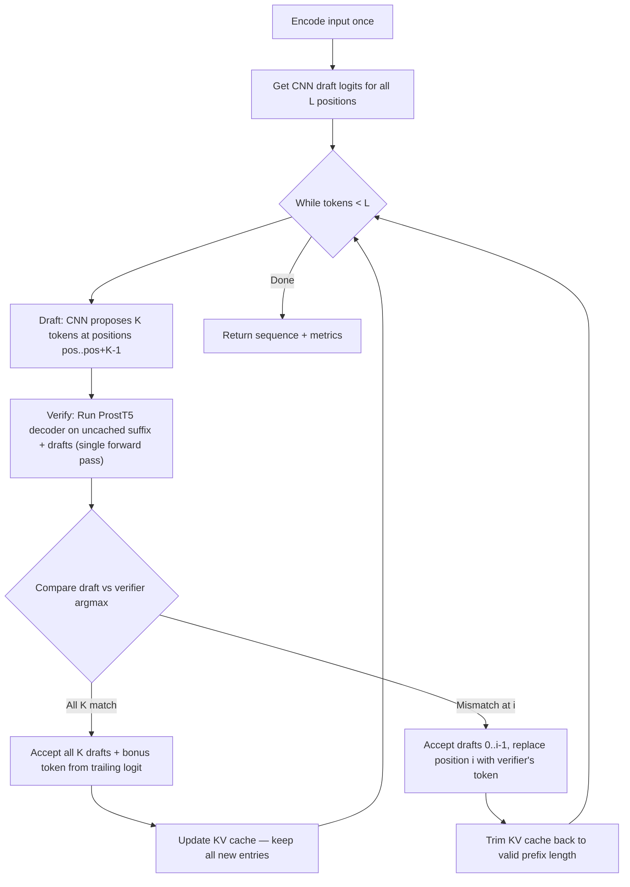

# The Greedy Speculative Decoding Algorithm




Edited speculative_decoding_architecture.md
Viewed spec_decoding_greedy_architecture.md:1-18

Here's a detailed comparison of the two algorithms as implemented in the notebook:

## Greedy vs. Stochastic Speculative Decoding

### 1. Drafting Phase

| Aspect | Greedy | Stochastic |
|---|---|---|
| **How drafts are chosen** | `argmax` of CNN logits → deterministic | `torch.multinomial` sampling from `softmax(CNN_logits / T)` → random |
| **Temperature** | Not used | Controls sharpness of draft distribution `q(x)` |
| **Same input → same drafts?** | Yes, always | No, different each run |

### 2. Acceptance Rule — The Core Difference

**Greedy** (Cell 9): Simple equality check.
```python
# For each draft position i:
if draft_token_ids[i] == verifier_tokens[i]:   # argmax == argmax?
    n_accepted += 1
else:
    rejected_replacement = verifier_tokens[i]   # use verifier's argmax instead
    break
```
The verifier computes its own argmax. If it matches the draft → accept. First mismatch → reject and **replace with verifier's argmax**. That's it — completely deterministic.

**Stochastic** (Cell 10): Probabilistic acceptance with a ratio test.
```python
# For each draft position i:
p_x = p_probs_full[drafted_vocab_id]   # verifier's probability of drafted token
q_x = q_probs[i, drafted_cnn_idx]      # drafter's probability of drafted token

accept_prob = min(1.0, p_x / q_x)      # Leviathan's acceptance probability
r = torch.rand(1).item()               # random coin flip

if r < accept_prob:
    n_accepted += 1
else:
    # Resample from max(0, p - q) distribution
    adjusted = torch.clamp(p_aa - q_aa, min=0)
    adjusted = adjusted / adjusted.sum()
    resampled_token = torch.multinomial(adjusted, 1)
```

The key insight: **even if the drafter picks a low-probability token**, it can still be accepted if the verifier also assigns it low probability (the ratio `p/q` could still be ≥ 1). Conversely, a high-probability draft can be rejected if the drafter was *overconfident* relative to the verifier (`p/q < 1`).

### 3. Rejection Recovery

| | Greedy | Stochastic |
|---|---|---|
| **On rejection** | Use verifier's `argmax` — deterministic | Sample from `norm(max(0, p − q))` — the "residual" distribution |
| **Why this works** | Greedy decoding always picks the top token | Ensures the *combined* draft+rejection process samples from `p(x)` exactly |

The stochastic rejection resampling is mathematically clever: `max(0, p − q)` captures the probability mass that the verifier assigns but the drafter "missed." Sampling from this residual guarantees the overall token distribution equals the verifier's distribution `p(x)`.

### 4. Bonus Token

| | Greedy | Stochastic |
|---|---|---|
| **When all K accepted** | `argmax` of verifier's next-position logits | `multinomial` sample from verifier's next-position softmax (restricted to 20 AAs) |

### 5. KV-Cache Usage

| | Greedy | Stochastic |
|---|---|---|
| **Uses KV-cache** | ✅ Yes — only feeds uncached suffix to decoder | ❌ No — feeds full `generated_token_ids + drafts` every time |
| **Cache trimming on reject** | Trims self-attention KV cache to valid prefix | N/A |

This is a significant **implementation difference**: the greedy version is optimized with KV-cache reuse, making it faster in practice. The stochastic version feeds the entire sequence each time (simpler code, but redundant computation).

### 6. What They Guarantee

| Property | Greedy | Stochastic |
|---|---|---|
| **Output guarantee** | Identical to plain `model.generate(do_sample=False)` | Samples from the **exact same distribution** as `model.generate(do_sample=True, temperature=T)` |
| **Deterministic?** | Yes | No |
| **Verified in notebook?** | ✅ Cell 11 proves all outputs match | Not explicitly tested |

### 7. Intuitive Summary

- **Greedy**: "Did the drafter guess the same top-1 token as the verifier? Yes → keep it. No → use the verifier's answer." Simple, fast, deterministic.

- **Stochastic**: "The drafter sampled token `x` with probability `q(x)`. The verifier would give it probability `p(x)`. Keep it with probability `p(x)/q(x)`. If rejected, sample from the distribution of tokens the verifier likes more than the drafter did." Mathematically elegant, preserves the full sampling distribution.